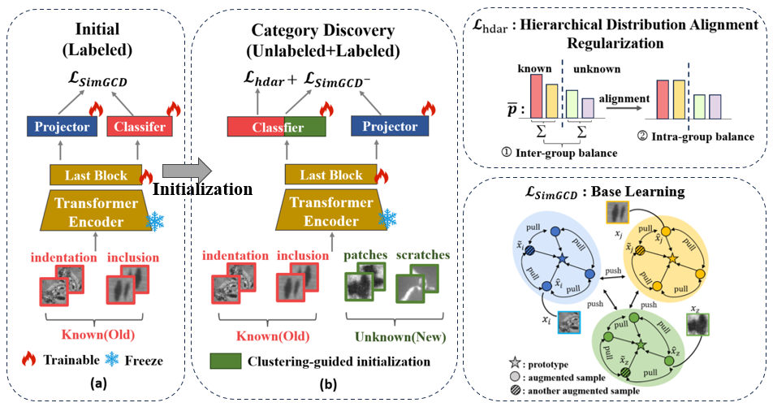

# BCPL: Boundary-Confusing Prototype Learning

### Hard-Sample-Aware Steel Surface Defect Detection via Boundary-Confusing Sample Clustering

[](LICENSE)

**BCPL** is a hard-sample-aware optimization framework for deep visual detection models. It addresses a critical yet underexplored problem in steel surface defect detection: visually similar defect categories produce *boundary-confusing samples* near class decision boundaries, and standard detectors struggle to discriminate them. BCPL moves beyond isolated hard-sample reweighting — it discovers the latent clustering structure of boundary-confusing samples, extracts representative prototypes, and converts them into staged dynamic loss weights that guide detector training.



---

## Overview

Standard detector training treats hard samples as independent instances and relies on prediction confidence or loss values to adjust their influence. Such sample-level strategies cannot explicitly describe the shared confusion patterns formed by ambiguous samples near category boundaries.

BCPL proposes a **progressive design** that discovers, represents, and uses boundary-confusion structure:

1. **AC-BPL** (Adaptive Clustering-based Boundary Prototype Learning) — identifies high-uncertainty samples near decision boundaries via joint Margin–Entropy selection, organizes them into local confusion clusters through adaptive density clustering, and condenses each cluster into a Medoid boundary prototype.
2. **BCDR** (Boundary-aware Dynamic Loss Re-weighting) — extends the classification head with boundary prototype dimensions, measures the relative response of class centers vs. boundary prototypes for each sample, and converts the estimated boundary hardness into dynamic loss weights with staged activation.

This shifts hard-sample handling from *sample-level selection* to *prototype-level structure modeling*.

---

## Key Results

| Dataset | Detector | Origin (Hard mAP@50) | Ours (Hard mAP@50) | Improvement |
|---------|----------|---------------------|-------------------|-------------|
| NEU-DET | YOLOv8s  | 0.324 | 0.357 | +3.3% |
| NEU-DET | YOLOv26s | 0.356 | **0.447** | +9.1% |
| NEU-DET | RF-DETRS | 0.357 | 0.374 | +1.7% |
| Severstal | YOLOv8s | 0.369 | 0.449 | +8.0% |
| Severstal | YOLOv26s | 0.598 | 0.606 | +0.8% |
| Severstal | RF-DETRS | 0.556 | 0.572 | +1.6% |
| MaSteel | YOLOv8s | 0.828 | 0.854 | +2.6% |
| MaSteel | YOLOv26s | 0.848 | 0.857 | +0.9% |
| MaSteel | RF-DETRS | 0.858 | 0.862 | +0.4% |

Consistent improvements across 3 datasets × 3 detectors. The gain is largest when inter-class confusion is most severe (e.g., NEU-DET + YOLOv26s: +9.1%).

Comparison with mainstream hard-sample methods (NEU-DET, YOLOv8s):

| Method | Hard-class mAP@50 | Overall mAP@50 |
|--------|-------------------|----------------|
| Origin (Baseline) | 0.324 | 0.671 |
| + Focal Loss | 0.346 | 0.681 |
| + OHEM | 0.339 | 0.673 |
| + LRM Loss | 0.314 | 0.680 |
| **+ BCPL (Ours)** | **0.357** | **0.692** |

---

## Method Pipeline

### Stage 1: Class Center Learning

A DINO-pretrained ViT-B/16 backbone is fine-tuned (last L Transformer blocks) with a multi-constraint composite loss:
- **Supervised classification loss** — anchors semantics to labels
- **Supervised contrastive loss** — intra-class compactness & inter-class separation
- **Unsupervised contrastive loss** — cross-view consistency & perturbation invariance
- **Clustering regularizer** — self-distillation + maximum entropy (prevents degeneracy)

Multi-view augmentation (color jitter, flip, crop, blur) produces two views per image; a momentum-like teacher branch enforces cross-view consistency.

### Stage 2: Boundary Prototype Discovery (AC-BPL)

1. **Uncertainty Selection** — Joint Margin + Entropy criterion selects samples that exhibit both strong two-class competition and broad multi-class uncertainty:
   - Low Margin: $p_{\max}^{(1)} - p_{\max}^{(2)}$ is small
   - High Entropy: $-\sum p_k \log p_k$ is large
   - Intersection of bottom-α quantile Margin and top-α quantile Entropy

2. **Adaptive Density Clustering** — on cosine distance with auto-estimated parameters:
   - `m_min` adapts to boundary set size
   - `ε` is estimated from the q-quantile of k-NN distances
   - Fallback: relax ε (1.5× → 2.0× → 3.0×), reduce m_min, or use mean feature

3. **Medoid Prototype Extraction** — For each cluster, select the real sample minimizing total cosine distance to all other members. Medoids are on-manifold and robust to outliers.

### Stage 3: Boundary-Aware Detector Training (BCDR)

1. **Extended Classification Head** — Append boundary prototype dimensions to the original class head. Known-class weights are copied; boundary weights are initialized with prototype directions, rescaled to match the mean L₂ norm.

2. **Boundary Hardness Estimation** — For each sample, compute `s_cls` (max known-class response) and `s_boundary` (max boundary-prototype response). Hardness: `δ = s_boundary − s_cls`.

3. **Dynamic Weight Mapping** — Amplify → Clip → Sigmoid → Normalize:
   ```
   w(x) = 1 + η·σ(clip(α·δ, [-β, β]))
   ```
   Weights ∈ (1, 1+η), batch-normalized to mean 1.

4. **Staged Activation** — Boundary weights are introduced gradually:
   - **Warmup stage**: uniform weights (build basic decision boundary)
   - **Transition stage**: linear ramp from 0 to 1
   - **Balance stage**: full boundary-aware weights active

---

## Repository Structure

```
BCPL/
├── main.py                  # Main training and evaluation script
├── model.py                 # Model definitions (DINOHead, losses, classifier)
├── cluster.py               # Clustering utilities (K-Means-based)
├── cluster_dbscan.py        # Adaptive density clustering (AC-BPL core)
├── class_magang.py          # Class center learning with multi-constraint loss
├── config.py                # Dataset paths and experiment configuration
├── new_run_inference.py     # Inference and prototype extraction
├── data/                    # Dataset loaders and augmentations
│   ├── get_datasets.py      # Dataset loading (NEU-DET, GC10-DET, MaSteel, etc.)
│   ├── augmentations/       # Multi-view data augmentation
│   └── ssb_splits/          # Open-set recognition splits
├── scripts/
│   └── run_xc.sh            # Training launch script
├── assets/
│   └── net.png              # Method overview figure
└── requirements.txt         # Python dependencies
```

---

## Getting Started

### Dependencies

```bash
pip install -r requirements.txt
```

Main dependencies: PyTorch 1.10+, torchvision, numpy, pandas, scikit-learn, scipy, tqdm, loguru.

### Configuration

Set dataset paths and log directories in `config.py`:

```python
xc_root = '/path/to/your/dataset'
exp_root = 'dev_outputs'   # Logs and checkpoints
```

### Datasets

Experiments in the paper use three steel surface defect datasets:

- **NEU-DET** — 6 defect classes, 300 images/class, 200×200 grayscale
- **Severstal-Steel-Defect** — ~12.5K images, 4+ combined defect categories
- **MaSteel** — Private real-production dataset with expert annotations

### Training

```bash
# Run the full pipeline
bash scripts/run_xc.sh
```

Or step-by-step:

```bash
# Stage 1: Class center learning with multi-constraint loss
python main.py --dataset xc --mode train

# Stage 2: Boundary prototype extraction (automatic after training)

# Stage 3: Detector training with BCDR (integrated into detection pipeline)
```

---

## Citation

If you find this work useful, please cite:

```bibtex
@article{yang2025boundary,
  title={Boundary-Confusing Sample Clustering for Hard-Sample-Aware Steel Surface Defect Detection},
  author={Yang, Songpu and Ma, Boyuan and Zhou, Peng},
  journal={Expert Systems with Applications},
  year={2025},
  publisher={Elsevier}
}
```

---

## Acknowledgements

This work was supported by the National Science and Technology Major Project under Grant 2024ZD0608200. The computing work is supported by USTB MatCom of the Beijing Advanced Innovation Center for Materials Genome Engineering. The codebase builds in part on [SimGCD](https://github.com/CVMI-Lab/SimGCD).

## License

This project is licensed under the MIT License — see the [LICENSE](LICENSE) file for details.
